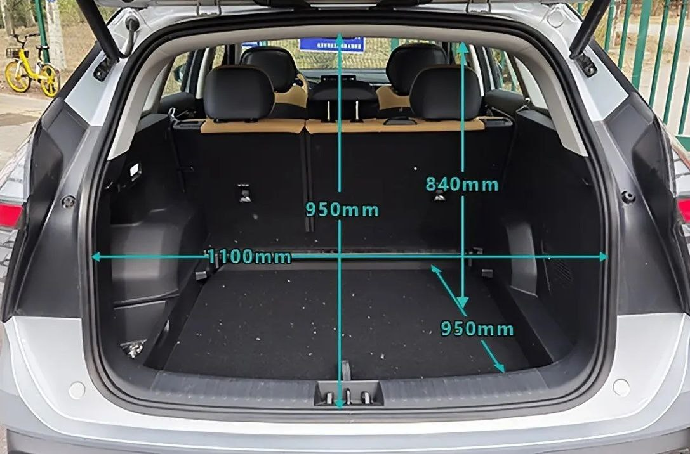
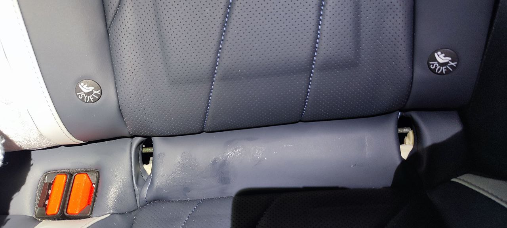
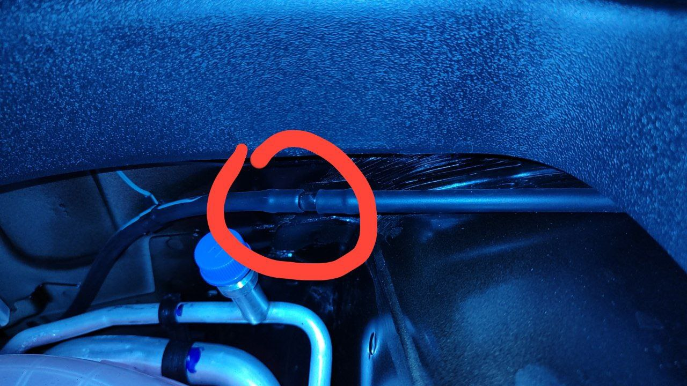

## Характеристики

### Размеры багажника

## Запчасти

Geely Boyue L 2 литра

Параметры дисков R18 5х108 ет 45 63.4

Размер - R19 235/50

Размер - R19 225/55 

воздушный фильтр, 2032069500

фильтр кондиционера, 8025530600

масляный фильтр  1056025900

## Частые вопросы по эксплуатации

### Можно ли отключить подушку безопасности спереди

Нельзя. ISOFix спереди так же нет. 

### Где находятся изофикс

### Машины пытается подруливать

Можно отключить систему экстренного удержания в полосе

### Дворники включаются раньше, чем подается омывайка

Решение поставить обратный клапан, подходит от toyota. Некоторые считают что есть риск повредить насос, если замерзнет омывайка, так что доделака на свой страх и риск

ставится сюда (за фото thnx to Марат):

### Как стоять  на светорфоре (я не проверял)

И на остановке (например на светофоре) тоже педаль тормоза дави или вкл функцию автохолд. Если педаль не будешь прожимать до конца , то сцепление не разомкнется. По оборотам увидишь, должно быть 700, если 800 , то педаль тормоза не прожал.

### Не хватает угла наклона сиденья

TODO: добавить фото с проставками

## Хитрости с ГУ

### Верный способ сломать ГУ, не надо так делать!!!

В инженерном меню нажать на обновление с usb и надо чтобы флэшка стояла, тогда словим recovery mode и поедем к дилеру на обновление 

### Подключение iPhone

У кого IPhone то переходите в настройки-универсальный доступ-касание-AssistiveTouch и калибровка проходит мгновенно

TODO: описать как сделать экшен с автовключением его с подключением к блютусу машины

### Перезагрузка

1. Заглушить машину
2. 

## Проблемы и решения

### Черный экран ГУ

Варианты решения:

1. перезагрузить магнитолу

### Заканчивается место в ГУ

### Скрипит водительское сидение

Съездили к дилеру, он разобрал/собрал, скрипет пересло, так и не поняли в чем была проблема

> Добрый вечер! Во вторник я здесь писала о скрипе водительского сиденья! Как обещала пишу результат ). Сегодня ездили к ОД, оставляли машину на несколько часов. Снимали сиденье, разбирали, особо ничего не нашли, переустановили сидение заново, скрипа нет. 

## Полезные ссылки и видео

https://youtu.be/-lyF-hsw1G8?si=Jo26sKkHNPnlJxVO - Оклейка экрана мультимедия Geely Monjaro

https://www.drive2.ru/l/665519545959592559/ - установка приложений, касается скорее всего только ПИ

https://dzen.ru/video/watch/65c4fbe612728b7e2aa7f06e - активация carplay, android auto ОД

https://www.drive2.ru/l/668059142941850651/ - Настройка CarPlay текстом

https://drive2-ru.turbopages.org/turbo/drive2.ru/s/l/605760814112068596/ - FAQ: зачем нужен AutoHold, ведь и без него машина не откатывается назад?

## Что купить

1. Коврики в салон полимерные 3D Norplast для Geely Atlas Pro (2023-2024) № NPA11-C24-033 - купить по лучшей цене на mirdopov.ru https://mirdopov.ru/katalog/dopolnitelnoe-oborudovanie/kovriki-1/geely/atlas/kovriki-v-salon-polimernyie-3d-norplast-dlya-geely-atlas-pro-(2023-2024).html

2. Полный комплект матовой защитной пленки для салона.  https://ozon.ru/t/1g052R1

3. Датчик давления в шинах Geely, Zeekr, Lynk & Co https://www.avito.ru/moskva/zapchasti_i_aksessuary/datchik_davleniya_v_shinah_geely_zeekr_lynk_co_3477006981?utm_campaign=native&utm_medium=item_page_android&utm_source=soc_sharing

4. Шторка в багажник на Али https://sl.aliexpress.ru/p?key=8cfxOJq 

5. Шторка в багажник Озон https://www.ozon.ru/product/shtorka-bagazhnika-polka-bagazhnika-geely-boyue-ii-boyuel-2022-2024-n-v-1280790214/

6. Брызговики для Geely Boyue L Starray FX11 https://sl.aliexpress.ru/p?key=FXkBO7Y

7. Защитный чехол брелок на ключ Geely Coolray Atlas Monjaro AUTOSOUL https://wildberries.ru/catalog/171855492/detail.aspx

8. Видеорегистратор для Geely Boyue L, 4K HD, Wi-Fi, два объектива за 7 631 ₽ - уже со скидкой -30%

   https://sl.aliexpress.ru/p?key=V7dLOqT

## Отзывы владельцев

### Лифанов Алексей

> Вообщем, пока жду замену резины, использовал сегодня киа соул жены. Впечатления: КАК, ВООБЩЕ, МОЖНО ЕЗДИТЬ НА ТАКОЙ МАШИНЕ???? Раньше мне все нравилось. После 1,5 месяца на Атласе, я просто в ужасе от всего на Соул.😂😂😂
>
> 1. Шумка в разы хуже (дополнительно на Атлас делал ОД только арки, и то антикором с эффектом шумки)
> 2. Подвеска вообще сравнивать нельзя, все кочки и ямки прочувствовал
> 3. Рулевое колесо не так точно реагирует
> 4. Педали?!?! Я тронутся не смог😂😂😂 Как на ЗИЛ 130 нажимать надо. На Атласе поглаживая и слегка касаясь.
> 5. Обзорность хуже. Ну тут, конечно, и машинка пониже.
> 6. Отделка внутри авто очень уступает Соул.
> 7. Расход 10,3 у Соул, против 9, 2 у Атласа. Только я люблю динамичную езду, а жена только летом права получила,соответственно пока еле еле.
> 8. Динамику разгона вообще сравнивать нельзя-однозначно в пользу Атласа.

### CapedBaldy

> Из последних: Forester SJ 2.5 2017. Sonata 8 2.5 2021, Tiguan 2022 2.0. Все в максималках. Конечно, трудно за пару дней, да и за полгода даже сказать о надежности, долговечности и прочем. Но вполне комфортный авто. Добавить бы полный привод - будет лучшим в классе. Из оснащения не хватает только слепых зон, но это скорее придирка. 
>
> Из эксплуатационных минусов отмечу только неадекватный климат. Сначала дубасит горячим воздухом, что ботинки на ногах теряют пару размеров, а потом начинает все это охлаждать. Хотя, на Тигуане тоже климат грубовато работал. А вот на Сонате я его почти не трогал, он сам отлично справлялся.
>
> В остальном хороший авто. Рулится и едет по европейски. Чувствуются отголоски Вольво и ее платформы. Сегодня ехал 120 , едет как влитой. Другие шушлайцы на 120 мотыляют как старая шаха с пьяным дедом за рулём. Здесь же чувствуются настройки CMA. 
>
> Рекомендую сразу делать шумку арок, в остальном шумка норм. 
>
> А, ещё свойственный 99% китайцев дешевле 4 млн стойких запашок. Фенол, наверное
>
> Только надо учитывать, что мотор тут хоть и ресурсный по современным реалиям, но только при должном обслуживании. К тому же, он одноразовый, не капиталится. Так что летом лить в него надо исключительно 100 бензин. Иначе детонации и все ее последствия. Я вообще лью только 100 всегда. 95 если только добраться до заправки с 100 в критических моментах. Так же, регулярная промывка форсуночек специальными жижами для непосредственного впрыска и промывка в масло от нагара. Ремень каждые 60, чтобы без сюрпризов. Масло в роботе на 50-60. Свечи 60. И разумеется то каждые 5-7 тыс. Никаких 10. Тогда он выходит свои 100-150 без особой жести и когда будете продавать, потенциальный покупатель не найдет засранных форсунок, нагара или осыпающихся свечей. Далее, следующий владелец отъездит еще 100 или в лучшем случае 150 и либо скинет, либо будет искать шорт блок за лям, как повезёт)
>
> Upd: не забываем так же про тормозушку каждые 2года/30к, антифриз каждые 3 года или 60к.
>
> Ну, либо по регламенту, а там как получится)

## Контакты

Пожалуйста, свяжитесь с клиентской поддержкой Geely через чат-бот (https://t.me/geely_support_bot) в Телеграме или направьте подробное письмо с описанием ситуации на почту customer@geely-motors.com.

Также можно обратиться в службу клиентской поддержки по телефону: 8 800 200-02-89 (звонок по России бесплатный).

Укажите в обращении модель, VIN-номер, а также ваши ФИО и контактные данные.